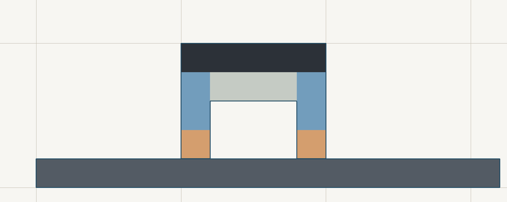

# JAX EvoGym

Build voxel robots, simulate their motion in JAX, and evaluate batches of controllers or body designs. `jax-evogym` reimplements the EvoGym soft-body simulator with JIT-compiled physics, seven built-in environments, a browser world designer, and a Python renderer.

[Documentation](https://jax-evogym.pages.dev/) · [Open the designer](https://jax-evogym.pages.dev/designer/) · [Quick start](https://jax-evogym.pages.dev/getting-started/quickstart/)



*An example world at its initial state, drawn by the library’s renderer. This is a static illustration, not a trained locomotion result. [Reproduce the image](scripts/render_readme.py).*

## What you can do

- **Design worlds:** draw robots and terrain in the browser, validate them, and export EvoGym world JSON.
- **Simulate tasks:** use the shared `reset()` / `step()` interface for walking, climbing, jumping, and shape-change environments.
- **Batch rollouts:** combine `jax.jit`, `jax.vmap`, and `jax.lax.scan` for controller evaluation and morphology research.
- **Build custom worlds:** compile reusable world templates, vary the robot body, and create mirrored configurations.
- **Inspect results:** render rollouts as GIFs and compare the simulator with checked-in EvoGym reference traces.

## Install

Requires **Python 3.11 or later**. Install from source; the package is not yet published on PyPI.

```bash
git clone https://github.com/btgaskin/jax-evogym.git
cd jax-evogym
python -m venv .venv
source .venv/bin/activate  # Windows PowerShell: .venv\Scripts\Activate.ps1
python -m pip install ".[viz]"
```

Use `pip install .` for the base package, `pip install ".[cuda,viz]"` for CUDA 12 on Linux, or `pip install -e ".[viz,dev]"` for development. The base package includes pinned CPU JAX dependencies; the visualization extra includes Pillow.

## Quick start

Create a three-cell robot and advance a built-in walking environment by one step:

```python
import jax.numpy as jnp
import numpy as np
from jax_evogym import H_ACT, SOFT, V_ACT, WalkerV0

body = np.array([[H_ACT, SOFT, V_ACT]])
env = WalkerV0(body)

obs, state = env.reset()
action = jnp.ones(env.n_actuators)
obs, state, reward, done = env.step(state, action)

print("Observation shape:", obs.shape)
print("Reward:", float(reward))
```

Actions specify actuator target lengths relative to their resting lengths. This example supplies a constant action; learning a controller is a separate task. The [rendering guide](https://jax-evogym.pages.dev/guides/rendering/) shows how to capture a rollout and save a GIF.

To load a world exported from the designer:

```python
from jax_evogym import EvoWorld, compile_world_template, instantiate_world

world = EvoWorld.from_json("evogym-world.json")
# Name the robot object "robot" in the designer, or pass its actual name here.
template = compile_world_template(world, robot_name="robot")
built = instantiate_world(template)
print(built.sim_state.positions.shape)
```

See [Environments](https://jax-evogym.pages.dev/guides/environments/), [Build API](https://jax-evogym.pages.dev/core/build-api/), and [Variable Morphology](https://jax-evogym.pages.dev/guides/variable-morphology/) for the next steps.

## Scope and status

This is a **public-alpha research library**. The supported core uses square cells: rigid and soft materials, horizontal and vertical actuators, contractile cells, and fixed terrain.

Worlds are compiled object by object. Robots and terrain have separate ownership; pure fixed terrain contributes collision and render geometry without adding dynamic simulation points. Soft terrain and mixed soft/fixed objects remain dynamic. The standard environment step runs 30 physics substeps.

Reference-parity tests cover the documented task set and tolerances; they do not establish identical behavior for every possible world. Slopes are retained only as an unsupported, opt-in geometry path. Slope friction/support, general freeform terrain, and dynamic polygon bodies are outside the stable contract.

Read the [API boundary](https://jax-evogym.pages.dev/reference/api-boundary/), [parity guide](https://jax-evogym.pages.dev/core/parity/), and [roadmap](ROADMAP.md) before extending the physics. The companion research project is [sensing-at-the-edges](https://github.com/btgaskin/sensing-at-the-edges).

## Documentation and designer development

The Astro/Starlight site runs independently of Python and JAX:

```bash
cd site
bun install --frozen-lockfile
bun run dev --host 127.0.0.1
```

Open the URL printed by Astro. The designer is at `/designer/` and its guide at `/designer/designer-guide/`.

From `site/`, run `bun run test`, `bun run check`, and `bun run build` to validate the frontend. The output is a static site in `site/dist/`.

## Tests and contribution

Install the development extra before running Python checks:

```bash
uv run --extra dev pytest tests/
```

The [parity harness](tests/parity_harness.py) consumes [checked-in reference traces](tests/reference_data). Re-run the relevant parity tests when changing physics or JAX versions. To reproduce the README illustration without running a simulation:

```bash
python scripts/render_readme.py
```

See [CONTRIBUTING.md](CONTRIBUTING.md) for checks and contribution guidelines, [CHANGELOG.md](CHANGELOG.md) for release notes, [SECURITY.md](SECURITY.md) for vulnerability reporting, and [CODE_OF_CONDUCT.md](CODE_OF_CONDUCT.md) for community expectations.

## JAX version policy

The package pins `jax` and `jaxlib` to `0.9.0.1`. The existing version rationale and tracked issues are retained below; issue status can change independently of this release.

<details>
<summary>Version rationale and runtime mitigations</summary>

This repository is pinned to:

- `jax==0.9.0.1`
- `jaxlib==0.9.0.1`

Reasoning:

- `0.9.1` is currently avoided because of an open upstream compile-time regression: [`jax-ml/jax#35958`](https://github.com/jax-ml/jax/issues/35958)
- the CUDA runtime still has relevant open upstream issues on the pinned line, so we optimize for the version we have already validated rather than chasing latest

Upstream JAX issues we currently track as relevant to this simulator:

- [`jax-ml/jax#35667`](https://github.com/jax-ml/jax/issues/35667): GPU runtime failures with cached HLO configs. This is the main remaining operational risk on the pinned version.
- [`jax-ml/jax#35762`](https://github.com/jax-ml/jax/issues/35762): incorrect GPU reduction of closure-captured all-`True` boolean constants under `jit`.
- [`jax-ml/jax#17844`](https://github.com/jax-ml/jax/issues/17844): severe `scatter_add` slowdown on GPU when deterministic ops are enabled.
- [`jax-ml/jax#35994`](https://github.com/jax-ml/jax/issues/35994): GPU OOMs are not always propagated cleanly to Python.

Mitigations implemented in this repo:

- environment `step()` methods now route runtime arrays through module-level JIT helpers instead of capturing large runtime structs through `@jax.jit(static_argnums=(0,))`
- collision metadata stores exact active-triple and robot-surface counts, and hot collision paths use those counts instead of reducing closure-captured boolean masks when an exact count is already known

If you change JAX versions, rerun the parity suite in [`tests`](tests) before trusting any parity or stability result.


</details>

## Acknowledgements

`jax-evogym` is a JAX-native reimplementation of [Evolution Gym](https://github.com/EvolutionGym/evogym) (EvoGym), the soft-body robot benchmark by Jagdeep Bhatia, Holly Jackson, Yunsheng Tian, Jie Xu, and Wojciech Matusik (NeurIPS 2021). Evolution Gym is distributed under the MIT License (Copyright © 2022 jagdeepsb). The physics model and the reference traces used for [parity validation](https://jax-evogym.pages.dev/core/parity/) are derived from it. See [`NOTICE`](NOTICE) for the full attribution and license text.

If you build on this work, please also cite the original benchmark:

> Bhatia, J., Jackson, H., Tian, Y., Xu, J., & Matusik, W. (2021). *Evolution Gym: A Large-Scale Benchmark for Evolving Soft Robots.* Advances in Neural Information Processing Systems (NeurIPS).

## License

`jax-evogym` is licensed under [Apache-2.0](LICENSE). EvoGym-derived material,
including reference traces and physics parameterization, is attributed under
the MIT License in [NOTICE](NOTICE).

### Runnable examples

Start with [First Simulation](https://jax-evogym.pages.dev/getting-started/first-simulation/) or the [source examples](examples/README.md). Guides cover [designer exports](https://jax-evogym.pages.dev/guides/designer-world/), [controllers](https://jax-evogym.pages.dev/guides/controllers/), and [evolutionary search](https://jax-evogym.pages.dev/guides/evolutionary-search/).
